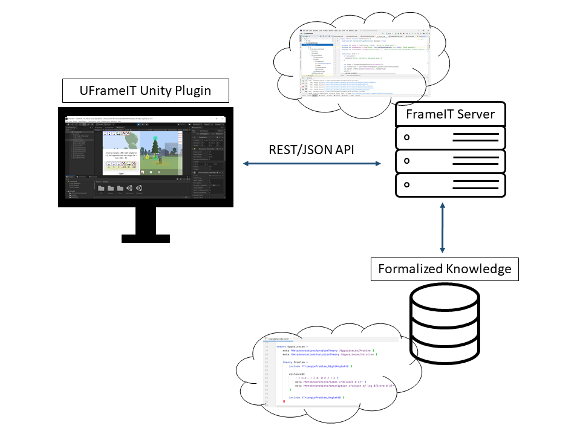

## Overview

FrameIT is a novel approach for building serious games by combining the exploration of virtual
worlds with logic-based knowledge management (... [details](#the-uframeit-framework-and-serious-games),
[publications](https://kwarc.github.io/bibs/frameit/), [news](#recent-news))

The [UFrameIT project](https://kwarc.info/systems/frameit) was initiated by the [KWARC Research Group](https://kwarc.info) at
[FAU Erlangen-Nürnberg](https://fau.eu) (... [news](#recent-news), [team](#uframeit-development--team), [history](#history)) to advance the FrameIT method and to create an appropriate framework for it.

<iframe width="560" height="315" src="https://www.youtube.com/embed/4hrL88jxcX0" frameborder="0" allow="accelerometer; autoplay; encrypted-media; gyroscope; picture-in-picture" allowfullscreen></iframe>

[... more videos](#demo-videos)

## Recent News
 
<ul class="collection">
    
        
    
</ul>

[→ see all](/news/)

## Try it out yourself

To showcase the framework, we plan to continuously create new simple game demos.
Built executables of previous releases can be found here: [UFrameIT releases](https://github.com/UFrameIT/UFrameIT/releases).

## The UFrameIT Framework and Serious Games

In the FrameIT method, we use [MMT][MMT] theory graphs to
encode and represent the knowledge about the world and its logic, whereas we use a game
engine (currently [Unity](https://unity.com); but others are possible) to create and visualize the virtual world.
The [MMT system][MMT] can then reason about the world and apply the knowledge in concrete situations.

Accordingly, the implementation is split into two parts that communicate via a [REST/JSON API](https://github.com/UniFormal/MMT/tree/devel/src/frameit-mmt#rest-api):
* the [UFrameIT Unity Plugin][UFrameIT], which supplies gadgets that help exploring the 3D world and an infrastructure
  for managing and applying knowledge, and
* the [FrameIT Server][mmt-server], which acts as an generic, game-engine-independent interface to the
[MMT system][MMT] and the
[formalized knowledge][FrameWorld].

A particular UFrameIT game instantiates the framework with
* a virtual world that acts as a game setting, additional gadgets for interacting with it,
  and 
* an [MMT](https://kwarc.info/projects/mmt) ontology that describes the virtual world and
  formalizes the learning goals conveyed by the game.

The latter builds on builds on the
[Math-in-the-Middle Ontology (MitM)](https://gl.mathhub.info/MitM) &mdash; a general-purpose
formalization of elementary mathematics developed and maintained by the [KWARC group at FAU](https://kwarc.info).

## UFrameIT Development & Team

The UFrameIT framework and games based on it are open source. They are [developed publicly
on GitHub](https://github.com/UFrameIT) ([documentation](https://github.com/UFrameIT/UFrameIT/blob/master/README.md), [issues](https://github.com/UFrameIT/UFrameIT/issues), [milestones](https://github.com/UFrameIT/UFrameIT/milestones))

We are an open team of developers, please feel free to join.

### Current Members
* [Prof. Dr. Michael Kohlhase](https://kwarc.info/people/mkohlhase/) (lead; enjoys the demos) 
* [Richard Marcus](https://kwarc.info/people/rmarcus/) ([Unity Plugin][Unity Plugin])
* [Navid Roux](https://kwarc.info/people/nroux/) ([mmt-server][mmt-server], [MMT][MMT] extensions, and MMT formalizations)
* [John Schihada](https://kwarc.info/people/jschihada/) ([Unity Plugin][Unity Plugin], [mmt-server][mmt-server])
* Marco Zimmer ([FrameWorld][FrameWorld] levels)
* Sebastian Weber (Visual Problem Editor)
* Stefan Richter (Android Port)
* Volodymir Marych (Machine Learning Experiments) 

### Advisors
* [Dennis Müller](https://kwarc.info/people/dmueller/) ([MMT][MMT] and Formalization Guru)
* [Prof. Dr.-Ing. Marc Stamminger](https://www.lgdv.tf.fau.de/person/marc-stamminger/)
  (Graphics/Virtual Worlds)
* [Prof. Dr. Andrea Kohlhase](https://www.hnu.de/andrea-kohlhase/)
  (Interaction Design and UX)
 * [Christian Kropfeld](https://www.prime-mesh.de)
 (Video Editing and Design)

### Former Members 
* Benjamin Bösl ([mmt-server][mmt-server], MMT formalizations of [FrameWorld v1][FrameWorld]) 
* Denis Rochau (first Unreal-based FrameIT implementation) 

[FrameWorld]: https://gl.mathhub.info/FrameIT/frameworld
[MMT]: https://uniformal.github.io/
[mmt-server]: https://github.com/UniFormal/MMT/tree/devel/src/frameit-mmt
[UFrameIT]: https://github.com/UFrameIT/UFrameIT
[Unity Plugin]: https://github.com/UFrameIT/UFrameIT

## History

#### The [Jacobs University](https://jacobs-university.de) Phase

The idea behind FrameIT was already formulated in a [paper in 2012](http://kwarc.info/kohlhase/submit/activeex-2012.pdf).
A very first version was implemented in [a 2013 bachelor thesis](https://gl.kwarc.info/supervision/BSc-archive/-/blob/master/2013/rachev_daniel/project/thesis/thesis.pdf).
In 2015/6, Denis Rochau gave a complete implementation based on the [Unreal Engine](https://www.unrealengine.com) ([Bachelor's Thesis](https://gl.kwarc.info/supervision/BSc-archive/blob/master/2016/rochau_denis.pdf); [CICM Work-in-Progress Paper](http://ceur-ws.org/Vol-1785/W50.pdf), [demo video](https://gl.kwarc.info/FrameIT/CICM16-WiP/-/blob/master/Screen%2005-12-2016%2020-17-23.avi)).

#### UFrameIT at [FAU Erlangen-Nürnberg](https://fau.de)

After a long period, where students with graphics and game development expertise didn't find their way to FrameIT, the cooperation with the [Chair of Visual Computing](https://www.lgdv.tf.fau.de/) brought together a group of FAU students in late 2019 to restart the project. The UFrameIT framework using the [Unity game engine](https://unity.com) as a basis is the result of this effort. 

## Demo Videos

### Most Recent
<iframe width="560" height="315" src="https://www.youtube.com/embed/4hrL88jxcX0" frameborder="0" allow="accelerometer; autoplay; encrypted-media; gyroscope; picture-in-picture" allowfullscreen></iframe>

### CICM 2020 Game Demo: Frameworld 
<iframe width="560" height="315" src="https://www.youtube.com/embed/98D2PYgflPw" frameborder="0" allow="accelerometer; autoplay; encrypted-media; gyroscope; picture-in-picture" allowfullscreen></iframe>

### The 2016 Version
<iframe width="560" height="315" src="https://www.youtube.com/embed/GWuySbzJUwQ" frameborder="0" allow="accelerometer; autoplay; encrypted-media; gyroscope; picture-in-picture" allowfullscreen></iframe>

## Support and Contact

To contact a human: reach out to [Michael Kohlhase](https://kwarc.info/kohlhase).

Feel free to raise an issue at our
[UFrameIT/UFrameIT repository](https://github.com/UFrameIT/UFrameIT/issues) or a question
on our [Mattermost FrameIT channel](https://mattermost.kwarc.info/kwarc/channels/frameit).
The latter is public, too, and you can easily join by authenticating with your GitHub account once.

<!--  LocalWords:  frameit-team frameborder allowfullscreen formalized Navid Schihada
 -->
<!--  LocalWords:  Stamminger Bösl endfor the-uframeit-framework-and-serious-games mdash
 -->
<!--  LocalWords:  uframeit-development
 -->
